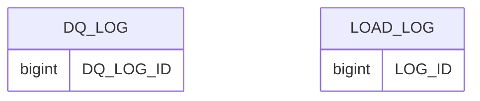

# AUDIT data model

## Summary
- **Tables**: 2
- **Columns**: 30
- **Constraints present**: true
- **Constraints notes**: TABLE_CONSTRAINTS returned PKs; KEY_COLUMN_USAGE not accessible, so PK/FK column mappings unavailable.

## Tables

### DQ_LOG (BASE TABLE)
- **Classification**: FACT (confidence: medium)
- **Key candidates**: `DQ_LOG_ID`
- **Notes**: Log/metrics table with counts/rates/timestamps.

### LOAD_LOG (BASE TABLE)
- **Classification**: FACT (confidence: medium)
- **Key candidates**: `LOG_ID`
- **Notes**: Pipeline load metrics (rows_*, timestamps, status).

## Relationships
No relationships provided for this schema.

## Common column / transformation patterns
- **metrics**: `ROWS_EXTRACTED`, `ROWS_LOADED`, `ROWS_REJECTED`, `ROWS_UPDATED`, `ROWS_CHECKED`, `ROWS_FAILED`, `FAILURE_RATE`
- **timestamps**: `START_TIME`, `END_TIME`, `CREATED_AT`, `CHECKED_AT`
- **keys**: `DQ_LOG_ID`, `LOG_ID`, `BATCH_ID`

## Diagram (Mermaid)

