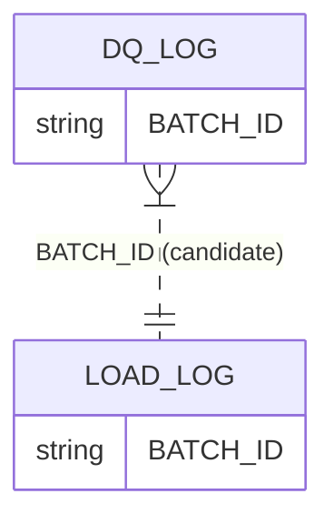

# RETAIL_DWH · AUDIT schema

Data-model documentation for the `RETAIL_DWH.AUDIT` schema.

- **Database:** `RETAIL_DWH`
- **Schema:** `AUDIT`
- **Generated from:** warehouse metadata (constraints available by name; PK/FK column lists not enumerable)

## Overview

| Item | Count |
|---|---:|
| Tables | 2 |
| Views | 0 |
| Columns | 30 |
| Constraints present | Yes |
| FK constraints present | No |

## Entities

### FACT · DQ_LOG

**Why this classification (confidence: medium):**
- Log/event grain with numeric measures (ROWS_CHECKED, ROWS_FAILED, FAILURE_RATE, THRESHOLD_PCT)
- Timestamp column CHECKED_AT

**Primary key:** Declared (constraint: `SYS_CONSTRAINT_2aadb510-1692-495f-8cd2-cab9ff39e03a`). PK column list not available.

### FACT · LOAD_LOG

**Why this classification (confidence: medium):**
- Pipeline/load event grain with rowcount measures (ROWS_EXTRACTED/LOADED/REJECTED/UPDATED)
- Start/end timestamps

**Primary key:** Declared (constraint: `SYS_CONSTRAINT_8992895e-d659-42af-b37c-2ce1fa5125db`). PK column list not available.

## Relationships

> Note: no FK column mappings available; relationships below are inferred from naming/metadata.

- **DQ_LOG.BATCH_ID → LOAD_LOG.BATCH_ID** (join candidate; confidence: low)
  - Basis: Shared column name BATCH_ID; no FK metadata available

## Common transformation patterns

- **Keys**: `DQ_LOG.DQ_LOG_ID`, `LOAD_LOG.LOG_ID`, `DQ_LOG.BATCH_ID`
- **Date/timestamps**: `DQ_LOG.CHECKED_AT`, `LOAD_LOG.START_TIME`, `LOAD_LOG.END_TIME`, `LOAD_LOG.CREATED_AT`
- **Aggregations / measures**: `DQ_LOG.ROWS_CHECKED`, `DQ_LOG.ROWS_FAILED`, `LOAD_LOG.ROWS_LOADED`

## Diagram (Mermaid)

