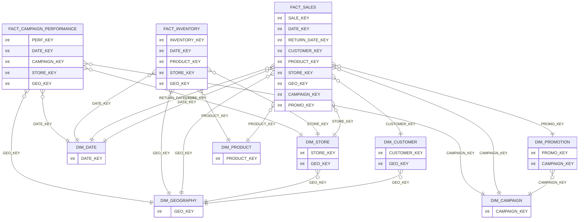

# CORE data model

## Summary
- **Tables**: 10
- **Columns**: 223
- **Constraints present**: yes
- **Constraints notes**: TABLE_CONSTRAINTS + REFERENTIAL_CONSTRAINTS returned; KEY_COLUMN_USAGE not accessible so FK column-level mappings are inferred via naming.

## Tables

### Dimensions
- **DIM_CAMPAIGN** (BASE TABLE) — key candidates: `CAMPAIGN_KEY` (confidence: high)
  - Notes: Declared PK present.
- **DIM_CUSTOMER** (BASE TABLE) — key candidates: `CUSTOMER_KEY` (confidence: high)
  - Notes: SCD-like columns (EFF_START_DATE, EFF_END_DATE, IS_CURRENT).
- **DIM_DATE** (BASE TABLE) — key candidates: `DATE_KEY` (confidence: high)
  - Notes: Calendar dimension.
- **DIM_GEOGRAPHY** (BASE TABLE) — key candidates: `GEO_KEY` (confidence: high)
  - Notes: Geography dimension.
- **DIM_PRODUCT** (BASE TABLE) — key candidates: `PRODUCT_KEY` (confidence: high)
  - Notes: Product dimension.
- **DIM_PROMOTION** (BASE TABLE) — key candidates: `PROMO_KEY` (confidence: high)
  - Notes: Promotion dimension.
- **DIM_STORE** (BASE TABLE) — key candidates: `STORE_KEY` (confidence: high)
  - Notes: Store dimension.

### Facts
- **FACT_CAMPAIGN_PERFORMANCE** (BASE TABLE) — key candidates: `PERF_KEY` (confidence: high)
  - Notes: Many metrics + multiple dimension keys.
- **FACT_INVENTORY** (BASE TABLE) — key candidates: `INVENTORY_KEY` (confidence: high)
  - Notes: Inventory measures + multiple dimension keys.
- **FACT_SALES** (BASE TABLE) — key candidates: `SALE_KEY` (confidence: high)
  - Notes: Sales measures + multiple dimension keys; has return fields.

## Relationships (inferred/declared)
> Note: FK existence is declared, but column-level mapping is inferred via naming because `KEY_COLUMN_USAGE` was not accessible.

- DIM_CUSTOMER.`GEO_KEY` → DIM_GEOGRAPHY.`GEO_KEY` (many-to-one, confidence: medium)
- DIM_STORE.`GEO_KEY` → DIM_GEOGRAPHY.`GEO_KEY` (many-to-one, confidence: medium)
- DIM_PROMOTION.`CAMPAIGN_KEY` → DIM_CAMPAIGN.`CAMPAIGN_KEY` (many-to-one, confidence: medium)
- FACT_SALES.`DATE_KEY` → DIM_DATE.`DATE_KEY` (many-to-one, confidence: medium)
- FACT_SALES.`RETURN_DATE_KEY` → DIM_DATE.`DATE_KEY` (many-to-one, confidence: low; role-playing date)
- FACT_SALES.`CUSTOMER_KEY` → DIM_CUSTOMER.`CUSTOMER_KEY` (many-to-one, confidence: medium)
- FACT_SALES.`PRODUCT_KEY` → DIM_PRODUCT.`PRODUCT_KEY` (many-to-one, confidence: medium)
- FACT_SALES.`STORE_KEY` → DIM_STORE.`STORE_KEY` (many-to-one, confidence: medium)
- FACT_SALES.`GEO_KEY` → DIM_GEOGRAPHY.`GEO_KEY` (many-to-one, confidence: medium)
- FACT_SALES.`CAMPAIGN_KEY` → DIM_CAMPAIGN.`CAMPAIGN_KEY` (many-to-one, confidence: medium)
- FACT_SALES.`PROMO_KEY` → DIM_PROMOTION.`PROMO_KEY` (many-to-one, confidence: medium)
- FACT_INVENTORY.`DATE_KEY` → DIM_DATE.`DATE_KEY` (many-to-one, confidence: medium)
- FACT_INVENTORY.`PRODUCT_KEY` → DIM_PRODUCT.`PRODUCT_KEY` (many-to-one, confidence: medium)
- FACT_INVENTORY.`STORE_KEY` → DIM_STORE.`STORE_KEY` (many-to-one, confidence: medium)
- FACT_INVENTORY.`GEO_KEY` → DIM_GEOGRAPHY.`GEO_KEY` (many-to-one, confidence: medium)
- FACT_CAMPAIGN_PERFORMANCE.`DATE_KEY` → DIM_DATE.`DATE_KEY` (many-to-one, confidence: medium)
- FACT_CAMPAIGN_PERFORMANCE.`CAMPAIGN_KEY` → DIM_CAMPAIGN.`CAMPAIGN_KEY` (many-to-one, confidence: medium)
- FACT_CAMPAIGN_PERFORMANCE.`STORE_KEY` → DIM_STORE.`STORE_KEY` (many-to-one, confidence: medium)
- FACT_CAMPAIGN_PERFORMANCE.`GEO_KEY` → DIM_GEOGRAPHY.`GEO_KEY` (many-to-one, confidence: medium)

## Common column / transformation patterns
- **keys**: `DATE_KEY`, `CUSTOMER_KEY`, `PRODUCT_KEY`, `STORE_KEY`, `GEO_KEY`, `CAMPAIGN_KEY`, `PROMO_KEY`
- **date**: `FULL_DATE`, `START_DATE`, `END_DATE`, `OPENING_DATE`, `CLOSING_DATE`, `RETURN_DATE_KEY`, `EFF_START_DATE`, `EFF_END_DATE`
- **flags**: `IS_ACTIVE`, `IS_NEWSLETTER`, `IS_CURRENT`, `IS_WEEKEND`, `IS_HOLIDAY`, `IS_OUT_OF_STOCK`, `IS_LOW_STOCK`, `IS_RETURNED`
- **metrics**: `QUANTITY`, `DISCOUNT_AMOUNT`, `NET_PRICE`, `TOTAL_COST`, `GROSS_MARGIN`, `SPEND`, `REVENUE_ATTRIBUTED`, `ROAS`, `CTR`, `CVR`, `CPC`, `CPM`, `CPA`, `OPENING_STOCK`, `CLOSING_STOCK`, `STOCK_VALUE_COST`, `STOCK_VALUE_RETAIL`

## Diagram (Mermaid)

