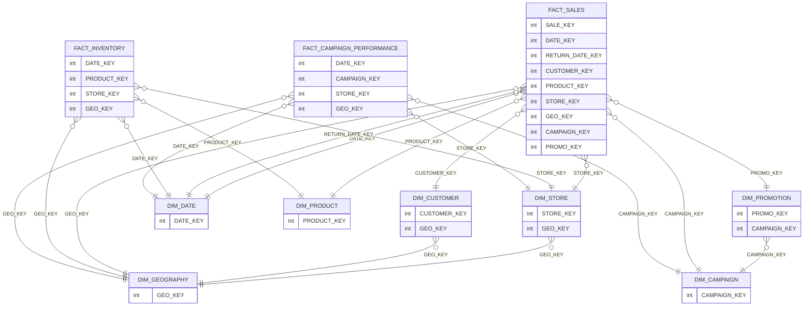

# RETAIL_DWH · CORE schema

Data-model documentation for the `RETAIL_DWH.CORE` schema.

- **Database:** `RETAIL_DWH`
- **Schema:** `CORE`
- **Generated from:** warehouse metadata (constraints available by name; PK/FK column lists not enumerable)

## Overview

| Item | Count |
|---|---:|
| Tables | 10 |
| Views | 0 |
| Columns | 223 |
| Constraints present | Yes |
| FK constraints present | Yes (existence visible; mappings not enumerable) |

## Entities (classification)

### Dimensions

- **DIM_CAMPAIGN** (confidence: high)
  - Descriptive attributes plus date range fields
  - Surrogate key CAMPAIGN_KEY present
  - PK declared: `SYS_CONSTRAINT_1bc607aa-f704-406e-992f-0ff8f5f91d0e`

- **DIM_CUSTOMER** (confidence: high)
  - Descriptive customer attributes
  - SCD pattern fields (EFF_START_DATE, EFF_END_DATE, IS_CURRENT)
  - PK declared: `SYS_CONSTRAINT_bf79055a-f4e6-4ebb-8b16-09ffe6127e87`

- **DIM_DATE** (confidence: high)
  - Calendar dimension attributes; key DATE_KEY
  - PK declared: `SYS_CONSTRAINT_4b1703d2-70e8-4d75-9b1b-58614e197364`

- **DIM_GEOGRAPHY** (confidence: high)
  - Geographic descriptors; key GEO_KEY
  - PK declared: `SYS_CONSTRAINT_a507dfa3-9864-4360-bbda-944728c1d3e7`

- **DIM_PRODUCT** (confidence: high)
  - Product descriptors; key PRODUCT_KEY
  - PK declared: `SYS_CONSTRAINT_fdbbe854-8335-4f35-a491-27ea895c2b01`

- **DIM_PROMOTION** (confidence: high)
  - Promotion descriptors; key PROMO_KEY
  - Contains CAMPAIGN_KEY as a reference-style column
  - PK declared: `SYS_CONSTRAINT_0893f334-44fd-4e45-93db-30ce70cd9011`

- **DIM_STORE** (confidence: high)
  - Store descriptors; key STORE_KEY
  - Contains GEO_KEY as a reference-style column
  - PK declared: `SYS_CONSTRAINT_0cd14523-46bc-4424-b977-602965cc1744`

### Facts

- **FACT_CAMPAIGN_PERFORMANCE** (confidence: high)
  - Many numeric measures (IMPRESSIONS, CLICKS, SPEND, ROAS, CTR, etc.)
  - Multiple key columns (DATE_KEY, CAMPAIGN_KEY, STORE_KEY, GEO_KEY)
  - PK declared: `SYS_CONSTRAINT_43784cd5-230a-472c-9014-57285cbfa6f0`

- **FACT_INVENTORY** (confidence: high)
  - Inventory measures and flags
  - Multiple key columns (DATE_KEY, PRODUCT_KEY, STORE_KEY, GEO_KEY)
  - PK declared: `SYS_CONSTRAINT_d127520f-1cd3-4adf-9833-a6e9febde383`

- **FACT_SALES** (confidence: high)
  - Sales measures (QUANTITY, NET_PRICE, TOTAL_COST, GROSS_MARGIN, TAX_AMOUNT, etc.)
  - Reference columns (DATE_KEY, CUSTOMER_KEY, PRODUCT_KEY, STORE_KEY, GEO_KEY, CAMPAIGN_KEY, PROMO_KEY)
  - PK declared: `SYS_CONSTRAINT_e7157708-927d-4d10-90e6-1a0901086641`

> PK column lists are not available (KEY_COLUMN_USAGE not accessible).

## Relationships

**Rule:** `many_to_one` relationships are considered solid (declared FK existence); exact column mappings are unavailable.

- DIM_CUSTOMER → DIM_GEOGRAPHY (via GEO_KEY) (many-to-one)
- DIM_PROMOTION → DIM_CAMPAIGN (via CAMPAIGN_KEY) (many-to-one)
- DIM_STORE → DIM_GEOGRAPHY (via GEO_KEY) (many-to-one)

- FACT_CAMPAIGN_PERFORMANCE → DIM_DATE (DATE_KEY) (many-to-one)
- FACT_CAMPAIGN_PERFORMANCE → DIM_CAMPAIGN (CAMPAIGN_KEY) (many-to-one)
- FACT_CAMPAIGN_PERFORMANCE → DIM_STORE (STORE_KEY) (many-to-one)
- FACT_CAMPAIGN_PERFORMANCE → DIM_GEOGRAPHY (GEO_KEY) (many-to-one)

- FACT_INVENTORY → DIM_DATE (DATE_KEY) (many-to-one)
- FACT_INVENTORY → DIM_PRODUCT (PRODUCT_KEY) (many-to-one)
- FACT_INVENTORY → DIM_STORE (STORE_KEY) (many-to-one)
- FACT_INVENTORY → DIM_GEOGRAPHY (GEO_KEY) (many-to-one)

- FACT_SALES → DIM_CAMPAIGN (CAMPAIGN_KEY) (many-to-one)
- FACT_SALES → DIM_DATE (DATE_KEY) (many-to-one)
- FACT_SALES → DIM_PRODUCT (PRODUCT_KEY) (many-to-one)
- FACT_SALES → DIM_GEOGRAPHY (GEO_KEY) (many-to-one)
- FACT_SALES → DIM_CUSTOMER (CUSTOMER_KEY) (many-to-one)
- FACT_SALES → DIM_STORE (STORE_KEY) (many-to-one)
- FACT_SALES → DIM_PROMOTION (PROMO_KEY) (many-to-one)
- FACT_SALES → DIM_DATE (RETURN_DATE_KEY → DATE_KEY) (many-to-one)

## Common transformation patterns

- **Keys**: `FACT_SALES.SALE_KEY`, `FACT_SALES.DATE_KEY`, `FACT_SALES.CUSTOMER_KEY`, `FACT_SALES.PRODUCT_KEY`, `FACT_SALES.STORE_KEY`, `FACT_SALES.GEO_KEY`
- **Date/timestamps**: `DIM_DATE.FULL_DATE`, `DIM_CUSTOMER.EFF_START_DATE`, `DIM_CUSTOMER.EFF_END_DATE`, `DIM_CAMPAIGN.START_DATE`, `DIM_CAMPAIGN.END_DATE`
- **Flags**: `DIM_CUSTOMER.IS_CURRENT`, `DIM_CUSTOMER.IS_ACTIVE`, `DIM_PRODUCT.IS_ACTIVE`, `FACT_SALES.IS_RETURNED`, `FACT_INVENTORY.IS_OUT_OF_STOCK`
- **Aggregations / measures**: `FACT_SALES.GROSS_PRICE`, `FACT_SALES.DISCOUNT_AMOUNT`, `FACT_SALES.NET_PRICE`, `FACT_SALES.TOTAL_COST`, `FACT_SALES.GROSS_MARGIN`, `FACT_CAMPAIGN_PERFORMANCE.ROAS`

## Diagram (Mermaid)

