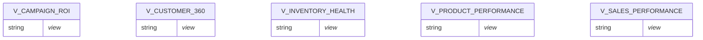

# MARTS data model

## Summary
- **Tables**: 5
- **Columns**: 128
- **Constraints present**: no
- **Constraints notes**: No constraints returned for this schema (views).

## Objects (Views)

### V_CAMPAIGN_ROI (VIEW)
- **Classification**: FACT (confidence: medium)
- **Key candidates**: _none_
- **Notes**: Aggregated KPIs (TOTAL_*, ROAS, CTR_PCT, CVR_PCT).

### V_CUSTOMER_360 (VIEW)
- **Classification**: DIMENSION (confidence: medium)
- **Key candidates**: `CUSTOMER_ID`
- **Notes**: Customer profile with aggregated measures (TOTAL_*).

### V_INVENTORY_HEALTH (VIEW)
- **Classification**: FACT (confidence: medium)
- **Key candidates**: _none_
- **Notes**: Inventory measures + derived status.

### V_PRODUCT_PERFORMANCE (VIEW)
- **Classification**: FACT (confidence: medium)
- **Key candidates**: `PRODUCT_ID`
- **Notes**: Product performance aggregates (NET_REVENUE_EUR, GROSS_PROFIT_EUR, UNIQUE_CUSTOMERS).

### V_SALES_PERFORMANCE (VIEW)
- **Classification**: FACT (confidence: medium)
- **Key candidates**: _none_
- **Notes**: Sales reporting view with measures and breakdown attributes.

## Relationships
No relationships provided for this schema.

## Common column / transformation patterns
- **aggregation**: `TOTAL_IMPRESSIONS`, `TOTAL_CLICKS`, `TOTAL_CONVERSIONS`, `TOTAL_SPEND`, `TOTAL_REVENUE_ATTRIBUTED`, `TOTAL_ORDERS`, `TOTAL_UNITS`, `TOTAL_SPEND_EUR`, `AVG_ORDER_VALUE_EUR`, `UNIQUE_CUSTOMERS`
- **date**: `FULL_DATE`, `LAST_ORDER_DATE`, `FIRST_ORDER_DATE`, `YEAR`, `MONTH_NAME`, `QUARTER_NAME`
- **flags**: `IS_ACTIVE`, `IS_NEWSLETTER`, `IS_OUT_OF_STOCK`, `IS_LOW_STOCK`, `IS_RETURNED`

## Diagram (Mermaid)

