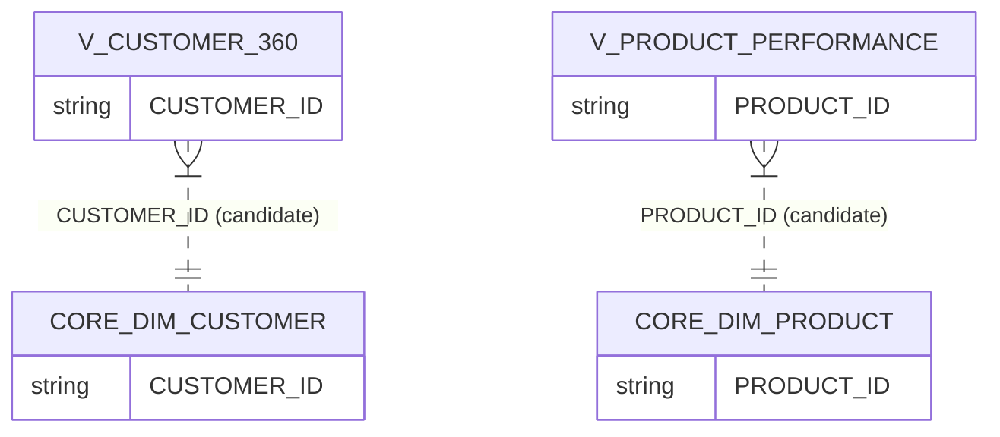

# RETAIL_DWH · MARTS schema

Data-model documentation for the `RETAIL_DWH.MARTS` schema.

- **Database:** `RETAIL_DWH`
- **Schema:** `MARTS`

## Overview

| Item | Count |
|---|---:|
| Tables | 0 |
| Views | 5 |
| Columns | 128 |
| Constraints present | No |
| FK constraints present | No |

## Entities (classification)

### Fact-like views

- **V_CAMPAIGN_ROI** (VIEW) — FACT (confidence: medium)
  - Aggregated measures (TOTAL_*, ROAS, CTR_PCT, CVR_PCT) and time buckets

- **V_INVENTORY_HEALTH** (VIEW) — FACT (confidence: medium)
  - Inventory measures/flags and time buckets

- **V_PRODUCT_PERFORMANCE** (VIEW) — FACT (confidence: medium)
  - Aggregated product performance measures (NET_REVENUE_EUR, GROSS_PROFIT_EUR, UNIQUE_CUSTOMERS)

- **V_SALES_PERFORMANCE** (VIEW) — FACT (confidence: medium)
  - Sales measures with dimensional descriptors and time buckets

### Dimension-like views

- **V_CUSTOMER_360** (VIEW) — DIMENSION (confidence: medium)
  - Denormalized customer profile projection with rollup metrics

> Views typically do not have PK/FK constraints.

## Relationships (inferred)

- **V_CUSTOMER_360.CUSTOMER_ID → CORE.DIM_CUSTOMER.CUSTOMER_ID** (join candidate; confidence: medium)
  - Basis: Strong naming match to CORE natural key

- **V_PRODUCT_PERFORMANCE.PRODUCT_ID → CORE.DIM_PRODUCT.PRODUCT_ID** (join candidate; confidence: medium)
  - Basis: Strong naming match to CORE natural key

## Common transformation patterns

- **Aggregations / measures**: `V_CAMPAIGN_ROI.TOTAL_IMPRESSIONS`, `V_CAMPAIGN_ROI.TOTAL_REVENUE_ATTRIBUTED`, `V_CUSTOMER_360.TOTAL_SPEND_EUR`, `V_PRODUCT_PERFORMANCE.GROSS_PROFIT_EUR`, `V_INVENTORY_HEALTH.STOCK_VALUE_RETAIL`
- **Date/timestamps**: `V_SALES_PERFORMANCE.FULL_DATE`, `V_INVENTORY_HEALTH.FULL_DATE`, `V_CUSTOMER_360.LAST_ORDER_DATE`
- **Flags**: `V_CUSTOMER_360.IS_ACTIVE`, `V_INVENTORY_HEALTH.IS_OUT_OF_STOCK`, `V_INVENTORY_HEALTH.IS_LOW_STOCK`, `V_SALES_PERFORMANCE.IS_RETURNED`
- **Keys / natural IDs**: `V_CUSTOMER_360.CUSTOMER_ID`, `V_PRODUCT_PERFORMANCE.PRODUCT_ID`

## Diagram (Mermaid)

