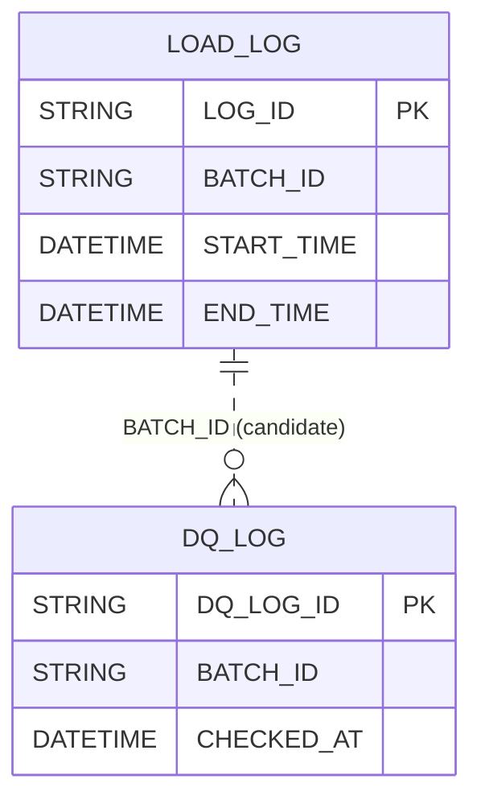

# RETAIL_DWH.AUDIT — Data Model

**Database:** `RETAIL_DWH`  
**Schema:** `AUDIT`  
**Warehouse:** `COMPUTE_WH`

## Summary
- **Tables:** 2
- **Views:** 0
- **Columns (total):** 30
- **Constraints present:** Yes
- **FK constraints present:** No
- **Metadata gaps:** KEY_COLUMN_USAGE not accessible; cannot enumerate PK/FK column lists

## Entities (tables)
| Entity | Type | Classification | Confidence | Primary key (declared) | PK constraint names | Notes |
|---|---|---|---|---:|---|---|
| `DQ_LOG` | BASE TABLE | FACT | medium | Yes | SYS_CONSTRAINT_2aadb510-1692-495f-8cd2-cab9ff39e03a | Event/log grain; measures: `ROWS_CHECKED`, `ROWS_FAILED`, `FAILURE_RATE`, `THRESHOLD_PCT`; timestamp `CHECKED_AT`. |
| `LOAD_LOG` | BASE TABLE | FACT | medium | Yes | SYS_CONSTRAINT_8992895e-d659-42af-b37c-2ce1fa5125db | Pipeline/load event grain; measures: `ROWS_EXTRACTED`, `ROWS_LOADED`, `ROWS_REJECTED`, `ROWS_UPDATED`; timestamps `START_TIME`, `END_TIME`. |

## Relationships
| From | To | Type | Confidence | Basis |
|---|---|---|---|---|
| `DQ_LOG(BATCH_ID)` | `LOAD_LOG(BATCH_ID)` | join_candidate | low | Shared column name `BATCH_ID`; no FK metadata available |

## Transformation patterns observed
- **keys:** `DQ_LOG.DQ_LOG_ID`, `LOAD_LOG.LOG_ID`, `DQ_LOG.BATCH_ID`
- **date_timestamp:** `DQ_LOG.CHECKED_AT`, `LOAD_LOG.START_TIME`, `LOAD_LOG.END_TIME`, `LOAD_LOG.CREATED_AT`
- **aggregation:** `DQ_LOG.ROWS_CHECKED`, `DQ_LOG.ROWS_FAILED`, `LOAD_LOG.ROWS_LOADED`

## Diagram (Mermaid ER)

