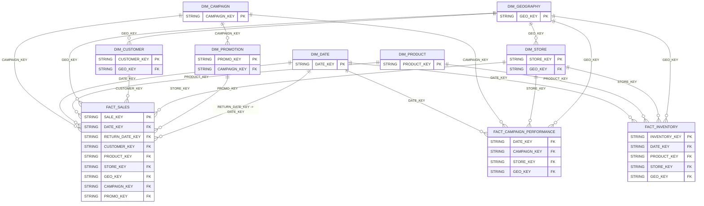

# RETAIL_DWH.CORE — Data Model

**Database:** `RETAIL_DWH`  
**Schema:** `CORE`  
**Warehouse:** `COMPUTE_WH`

## Summary
- **Tables:** 10
- **Views:** 0
- **Columns (total):** 223
- **Constraints present:** Yes
- **FK constraints present:** Yes
- **Metadata gaps:** KEY_COLUMN_USAGE not accessible; cannot enumerate PK/FK column lists

## Entities (tables)
| Entity | Type | Classification | Confidence | Primary key (declared) | PK constraint names | Notes |
|---|---|---|---|---:|---|---|
| `DIM_CAMPAIGN` | BASE TABLE | DIMENSION | high | Yes | SYS_CONSTRAINT_1bc607aa-f704-406e-992f-0ff8f5f91d0e | Descriptive attributes; surrogate key `CAMPAIGN_KEY`. |
| `DIM_CUSTOMER` | BASE TABLE | DIMENSION | high | Yes | SYS_CONSTRAINT_bf79055a-f4e6-4ebb-8b16-09ffe6127e87 | Customer attributes; SCD fields `EFF_START_DATE`, `EFF_END_DATE`, `IS_CURRENT`. |
| `DIM_DATE` | BASE TABLE | DIMENSION | high | Yes | SYS_CONSTRAINT_4b1703d2-70e8-4d75-9b1b-58614e197364 | Calendar dimension; key `DATE_KEY`. |
| `DIM_GEOGRAPHY` | BASE TABLE | DIMENSION | high | Yes | SYS_CONSTRAINT_a507dfa3-9864-4360-bbda-944728c1d3e7 | Geography descriptors; key `GEO_KEY`. |
| `DIM_PRODUCT` | BASE TABLE | DIMENSION | high | Yes | SYS_CONSTRAINT_fdbbe854-8335-4f35-a491-27ea895c2b01 | Product descriptors; key `PRODUCT_KEY`. |
| `DIM_PROMOTION` | BASE TABLE | DIMENSION | high | Yes | SYS_CONSTRAINT_0893f334-44fd-4e45-93db-30ce70cd9011 | Promotion descriptors; contains `CAMPAIGN_KEY` reference column. |
| `DIM_STORE` | BASE TABLE | DIMENSION | high | Yes | SYS_CONSTRAINT_0cd14523-46bc-4424-b977-602965cc1744 | Store descriptors; contains `GEO_KEY` reference column. |
| `FACT_CAMPAIGN_PERFORMANCE` | BASE TABLE | FACT | high | Yes | SYS_CONSTRAINT_43784cd5-230a-472c-9014-57285cbfa6f0 | Measures: `IMPRESSIONS`, `CLICKS`, `SPEND`, `ROAS`, `CTR`, etc. |
| `FACT_INVENTORY` | BASE TABLE | FACT | high | Yes | SYS_CONSTRAINT_d127520f-1cd3-4adf-9833-a6e9febde383 | Inventory measures/flags; keyed by date/product/store/geo. |
| `FACT_SALES` | BASE TABLE | FACT | high | Yes | SYS_CONSTRAINT_e7157708-927d-4d10-90e6-1a0901086641 | Sales measures; FK-style columns include `DATE_KEY`, `CUSTOMER_KEY`, `PRODUCT_KEY`, `STORE_KEY`, `GEO_KEY`, `CAMPAIGN_KEY`, `PROMO_KEY`. |

## Relationships
> Note: FK column mapping is unavailable in metadata; relationships below use provided from/to column lists.

| From | To | Type | Confidence | Basis |
|---|---|---|---|---|
| `DIM_CUSTOMER(GEO_KEY)` | `DIM_GEOGRAPHY(GEO_KEY)` | many_to_one | high | Declared FK exists (column mapping unavailable) |
| `DIM_PROMOTION(CAMPAIGN_KEY)` | `DIM_CAMPAIGN(CAMPAIGN_KEY)` | many_to_one | high | Declared FK exists (column mapping unavailable) |
| `DIM_STORE(GEO_KEY)` | `DIM_GEOGRAPHY(GEO_KEY)` | many_to_one | high | Declared FK exists (column mapping unavailable) |
| `FACT_CAMPAIGN_PERFORMANCE(DATE_KEY)` | `DIM_DATE(DATE_KEY)` | many_to_one | high | Declared FK exists (column mapping unavailable) |
| `FACT_CAMPAIGN_PERFORMANCE(CAMPAIGN_KEY)` | `DIM_CAMPAIGN(CAMPAIGN_KEY)` | many_to_one | high | Declared FK exists (column mapping unavailable) |
| `FACT_CAMPAIGN_PERFORMANCE(STORE_KEY)` | `DIM_STORE(STORE_KEY)` | many_to_one | high | Declared FK exists (column mapping unavailable) |
| `FACT_CAMPAIGN_PERFORMANCE(GEO_KEY)` | `DIM_GEOGRAPHY(GEO_KEY)` | many_to_one | high | Declared FK exists (column mapping unavailable) |
| `FACT_INVENTORY(DATE_KEY)` | `DIM_DATE(DATE_KEY)` | many_to_one | high | Declared FK exists (column mapping unavailable) |
| `FACT_INVENTORY(PRODUCT_KEY)` | `DIM_PRODUCT(PRODUCT_KEY)` | many_to_one | high | Declared FK exists (column mapping unavailable) |
| `FACT_INVENTORY(STORE_KEY)` | `DIM_STORE(STORE_KEY)` | many_to_one | high | Declared FK exists (column mapping unavailable) |
| `FACT_INVENTORY(GEO_KEY)` | `DIM_GEOGRAPHY(GEO_KEY)` | many_to_one | high | Declared FK exists (column mapping unavailable) |
| `FACT_SALES(CAMPAIGN_KEY)` | `DIM_CAMPAIGN(CAMPAIGN_KEY)` | many_to_one | high | Declared FK exists (column mapping unavailable) |
| `FACT_SALES(DATE_KEY)` | `DIM_DATE(DATE_KEY)` | many_to_one | high | Declared FK exists (column mapping unavailable) |
| `FACT_SALES(PRODUCT_KEY)` | `DIM_PRODUCT(PRODUCT_KEY)` | many_to_one | high | Declared FK exists (column mapping unavailable) |
| `FACT_SALES(GEO_KEY)` | `DIM_GEOGRAPHY(GEO_KEY)` | many_to_one | high | Declared FK exists (column mapping unavailable) |
| `FACT_SALES(CUSTOMER_KEY)` | `DIM_CUSTOMER(CUSTOMER_KEY)` | many_to_one | high | Declared FK exists (column mapping unavailable) |
| `FACT_SALES(STORE_KEY)` | `DIM_STORE(STORE_KEY)` | many_to_one | high | Declared FK exists (column mapping unavailable) |
| `FACT_SALES(PROMO_KEY)` | `DIM_PROMOTION(PROMO_KEY)` | many_to_one | high | Declared FK exists (column mapping unavailable) |
| `FACT_SALES(RETURN_DATE_KEY)` | `DIM_DATE(DATE_KEY)` | many_to_one | high | Declared FK exists (column mapping unavailable) |

## Transformation patterns observed
- **keys:** `DIM_DATE.DATE_KEY`, `DIM_PRODUCT.PRODUCT_KEY`, `FACT_SALES.SALE_KEY`, `FACT_SALES.ORDER_ID`, `FACT_INVENTORY.INVENTORY_KEY`
- **date_timestamp:** `DIM_DATE.FULL_DATE`, `DIM_CUSTOMER.EFF_START_DATE`, `DIM_CUSTOMER.EFF_END_DATE`, `DIM_PRODUCT.LAUNCH_DATE`, `DIM_STORE.OPENING_DATE`
- **flags:** `DIM_CUSTOMER.IS_CURRENT`, `DIM_PRODUCT.IS_ACTIVE`, `FACT_SALES.IS_RETURNED`, `FACT_INVENTORY.IS_OUT_OF_STOCK`
- **aggregation:** `FACT_SALES.NET_PRICE`, `FACT_SALES.TOTAL_COST`, `FACT_SALES.GROSS_MARGIN`, `FACT_CAMPAIGN_PERFORMANCE.ROAS`

## Diagram (Mermaid ER)

