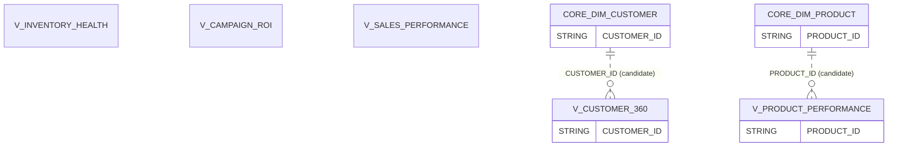

# RETAIL_DWH.MARTS — Data Model

**Database:** `RETAIL_DWH`  
**Schema:** `MARTS`  
**Warehouse:** `COMPUTE_WH`

## Summary
- **Tables:** 0
- **Views:** 5
- **Columns (total):** 128
- **Constraints present:** No
- **FK constraints present:** No

## Entities (views)
| Entity | Type | Classification | Confidence | Primary key (declared) | Notes |
|---|---|---|---|---:|---|
| `V_INVENTORY_HEALTH` | VIEW | FACT | medium | No | Measures/flags; time-bucket columns present. |
| `V_CUSTOMER_360` | VIEW | DIMENSION | medium | No | Customer profile view with rollup metrics. |
| `V_CAMPAIGN_ROI` | VIEW | FACT | medium | No | Aggregated campaign measures and rate metrics. |
| `V_PRODUCT_PERFORMANCE` | VIEW | FACT | medium | No | Aggregated product measures (e.g., `NET_REVENUE_EUR`, `GROSS_PROFIT_EUR`, `UNIQUE_CUSTOMERS`). |
| `V_SALES_PERFORMANCE` | VIEW | FACT | medium | No | Aggregated/denormalized sales measures with descriptors. |

## Relationships (join candidates)
| From | To | Type | Confidence | Basis |
|---|---|---|---|---|
| `V_CUSTOMER_360(CUSTOMER_ID)` | `CORE.DIM_CUSTOMER(CUSTOMER_ID)` | join_candidate | medium | Strong naming match to CORE natural key |
| `V_PRODUCT_PERFORMANCE(PRODUCT_ID)` | `CORE.DIM_PRODUCT(PRODUCT_ID)` | join_candidate | medium | Strong naming match to CORE natural key |

## Transformation patterns observed
- **aggregation:** `V_CUSTOMER_360.TOTAL_ORDERS`, `V_CUSTOMER_360.TOTAL_SPEND_EUR`, `V_CAMPAIGN_ROI.TOTAL_IMPRESSIONS`, `V_PRODUCT_PERFORMANCE.NET_REVENUE_EUR`, `V_SALES_PERFORMANCE.GROSS_MARGIN_EUR`
- **date_timestamp:** `V_SALES_PERFORMANCE.FULL_DATE`, `V_CUSTOMER_360.LAST_ORDER_DATE`
- **flags:** `V_CUSTOMER_360.IS_ACTIVE`, `V_INVENTORY_HEALTH.IS_OUT_OF_STOCK`, `V_SALES_PERFORMANCE.IS_RETURNED`

## Diagram (Mermaid ER)

