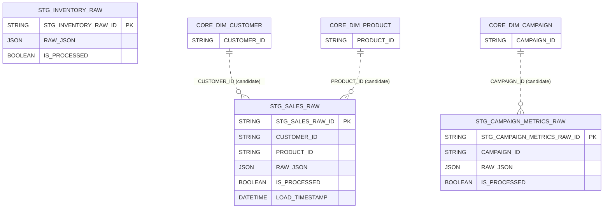

# RETAIL_DWH.STAGING — Data Model

**Database:** `RETAIL_DWH`  
**Schema:** `STAGING`  
**Warehouse:** `COMPUTE_WH`

## Summary
- **Tables:** 3
- **Views:** 0
- **Columns (total):** 46
- **Constraints present:** Yes
- **FK constraints present:** No
- **Metadata gaps:** KEY_COLUMN_USAGE not accessible; cannot enumerate PK column lists

## Entities (tables)
| Entity | Type | Classification | Confidence | Primary key (declared) | PK constraint names | Notes |
|---|---|---|---|---:|---|---|
| `STG_SALES_RAW` | BASE TABLE | FACT | low | Yes | SYS_CONSTRAINT_5bf7c356-94d1-48bd-8977-36839eb58e0c | Raw ingestion; order identifiers; numeric-like fields stored as TEXT; includes `RAW_JSON` + processing flags. |
| `STG_INVENTORY_RAW` | BASE TABLE | FACT | low | Yes | SYS_CONSTRAINT_1ab12f0e-bc93-47d8-be9b-54fc4488b17a | Raw inventory snapshot; measures stored as TEXT; includes `RAW_JSON` + processing flags. |
| `STG_CAMPAIGN_METRICS_RAW` | BASE TABLE | FACT | low | Yes | SYS_CONSTRAINT_1751fdbd-287b-4ad2-8dd1-313c85d9ff9f | Raw campaign metrics; measures stored as TEXT; includes `RAW_JSON` + processing flags. |

## Relationships (join candidates)
| From | To | Type | Confidence | Basis |
|---|---|---|---|---|
| `STG_SALES_RAW(CUSTOMER_ID)` | `CORE.DIM_CUSTOMER(CUSTOMER_ID)` | join_candidate | medium | Strong naming match to CORE natural key |
| `STG_SALES_RAW(PRODUCT_ID)` | `CORE.DIM_PRODUCT(PRODUCT_ID)` | join_candidate | medium | Strong naming match to CORE natural key |
| `STG_CAMPAIGN_METRICS_RAW(CAMPAIGN_ID)` | `CORE.DIM_CAMPAIGN(CAMPAIGN_ID)` | join_candidate | medium | Strong naming match to CORE natural key |

## Transformation patterns observed
- **semi_structured:** `STG_SALES_RAW.RAW_JSON`, `STG_INVENTORY_RAW.RAW_JSON`, `STG_CAMPAIGN_METRICS_RAW.RAW_JSON`
- **flags:** `STG_SALES_RAW.IS_PROCESSED`, `STG_INVENTORY_RAW.IS_PROCESSED`, `STG_CAMPAIGN_METRICS_RAW.IS_PROCESSED`
- **date_timestamp:** `STG_SALES_RAW.ORDER_DATE`, `STG_INVENTORY_RAW.SNAPSHOT_DATE`, `STG_CAMPAIGN_METRICS_RAW.REPORT_DATE`, `STG_SALES_RAW.LOAD_TIMESTAMP`

## Diagram (Mermaid ER)

