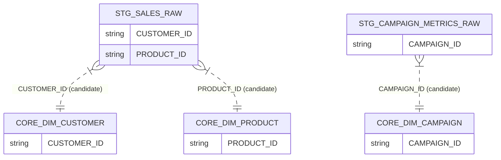

# RETAIL_DWH · STAGING schema

Data-model documentation for the `RETAIL_DWH.STAGING` schema.

- **Database:** `RETAIL_DWH`
- **Schema:** `STAGING`
- **Generated from:** warehouse metadata (constraints available by name; PK column lists not enumerable)

## Overview

| Item | Count |
|---|---:|
| Tables | 3 |
| Views | 0 |
| Columns | 46 |
| Constraints present | Yes |
| FK constraints present | No |

## Entities

### FACT · STG_CAMPAIGN_METRICS_RAW (raw landing)

**Why this classification (confidence: low):**
- Raw ingestion pattern (RAW_JSON) with processing flags
- Metric-like columns stored as TEXT (IMPRESSIONS, CLICKS, SPEND, CONVERSIONS)

**Primary key:** Declared (constraint: `SYS_CONSTRAINT_1751fdbd-287b-4ad2-8dd1-313c85d9ff9f`). PK column list not available.

### FACT · STG_INVENTORY_RAW (raw landing)

**Why this classification (confidence: low):**
- Raw ingestion pattern (RAW_JSON) with processing flags
- Inventory-like numeric fields stored as TEXT

**Primary key:** Declared (constraint: `SYS_CONSTRAINT_1ab12f0e-bc93-47d8-be9b-54fc4488b17a`). PK column list not available.

### FACT · STG_SALES_RAW (raw landing)

**Why this classification (confidence: low):**
- Raw ingestion pattern (RAW_JSON) with processing flags
- Order identifiers present; numeric fields stored as TEXT

**Primary key:** Declared (constraint: `SYS_CONSTRAINT_5bf7c356-94d1-48bd-8977-36839eb58e0c`). PK column list not available.

## Relationships (inferred join candidates)

- **STG_SALES_RAW.CUSTOMER_ID → CORE.DIM_CUSTOMER.CUSTOMER_ID** (join candidate; confidence: medium)
  - Basis: Strong naming match to CORE natural key

- **STG_SALES_RAW.PRODUCT_ID → CORE.DIM_PRODUCT.PRODUCT_ID** (join candidate; confidence: medium)
  - Basis: Strong naming match to CORE natural key

- **STG_CAMPAIGN_METRICS_RAW.CAMPAIGN_ID → CORE.DIM_CAMPAIGN.CAMPAIGN_ID** (join candidate; confidence: medium)
  - Basis: Strong naming match to CORE natural key

## Common transformation patterns

- **Semi-structured**: `STG_SALES_RAW.RAW_JSON`, `STG_INVENTORY_RAW.RAW_JSON`, `STG_CAMPAIGN_METRICS_RAW.RAW_JSON`
- **Flags**: `STG_SALES_RAW.IS_PROCESSED`, `STG_INVENTORY_RAW.IS_PROCESSED`, `STG_CAMPAIGN_METRICS_RAW.IS_PROCESSED`
- **Date/timestamps**: `STG_SALES_RAW.ORDER_DATE`, `STG_INVENTORY_RAW.SNAPSHOT_DATE`, `STG_CAMPAIGN_METRICS_RAW.REPORT_DATE`, `STG_SALES_RAW.LOAD_TIMESTAMP`
- **Keys**: `STG_SALES_RAW.RAW_ID`, `STG_SALES_RAW.ORDER_ID`, `STG_SALES_RAW.ORDER_LINE_ID`

## Diagram (Mermaid)

