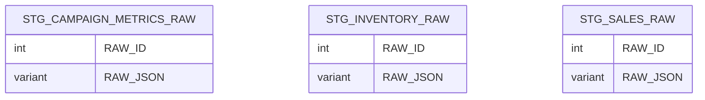

# STAGING data model

## Summary
- **Tables**: 3
- **Columns**: 46
- **Constraints present**: yes
- **Constraints notes**: PK constraints present; KEY_COLUMN_USAGE not accessible so PK column mappings not confirmed beyond naming.

## Tables

### STG_CAMPAIGN_METRICS_RAW (BASE TABLE)
- **Classification**: FACT (confidence: low)
- **Key candidates**: `RAW_ID`
- **Notes**: Raw landing table; many numeric fields stored as TEXT; includes RAW_JSON and load/process columns.

### STG_INVENTORY_RAW (BASE TABLE)
- **Classification**: FACT (confidence: low)
- **Key candidates**: `RAW_ID`
- **Notes**: Raw landing table; measures stored as TEXT; includes RAW_JSON and load/process columns.

### STG_SALES_RAW (BASE TABLE)
- **Classification**: FACT (confidence: low)
- **Key candidates**: `RAW_ID`
- **Notes**: Raw landing table; measures stored as TEXT; includes RAW_JSON and load/process columns.

## Relationships
No relationships provided for this schema.

## Common column / transformation patterns
- **raw_variant**: `RAW_JSON`
- **ingestion_audit**: `SOURCE_SYSTEM`, `SOURCE_FILE`, `BATCH_ID`, `LOAD_TIMESTAMP`, `ERROR_MESSAGE`
- **flags**: `IS_PROCESSED`
- **date_as_text**: `ORDER_DATE`, `SNAPSHOT_DATE`, `REPORT_DATE`

## Diagram (Mermaid)

