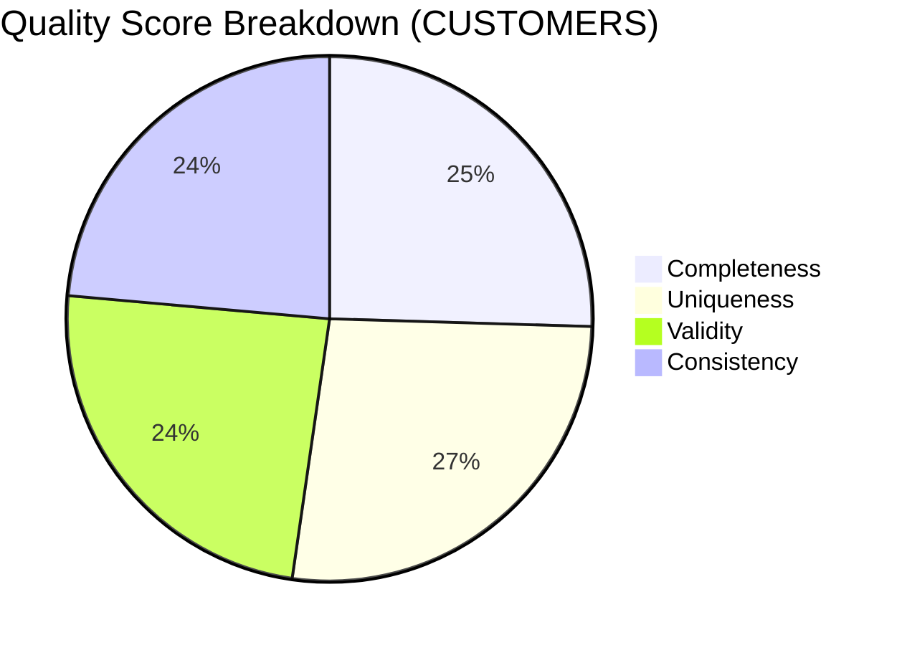

# Data Quality — RETAIL_DWH.PUBLIC.CUSTOMERS

## Executive Quality Dashboard

| Item | Value |
|---|---:|
| Database.Schema.Table | `RETAIL_DWH.PUBLIC.CUSTOMERS` |
| Row count | 12,543 |
| Overall quality score | **93 / 100** |
| Freshness (timestamp column) | `LAST_UPDATED` |
| Last updated (max observed) | `2026-07-06T17:42:51Z` |
| Max lag (hours) | 4 |
| PII columns | 2 (`EMAIL`, `PHONE`) |
| Duplicate rows | 12 (rate: 0.001) |

### Overall Quality Score

**Composite:** **93**

### KPI Summary

| KPI | Value |
|---|---:|
| Completeness | 95 |
| Uniqueness | 100 |
| Validity | 90 |
| Consistency | 88 |
| Freshness | See Freshness Overview |

### Critical Issues (from Quality Flags)

| Severity | Category | Column | Message |
|---|---|---|---|
| high | pii | EMAIL | Sensitive PII columns detected. |
| medium | nulls | PHONE | PHONE contains more than 5% NULL values. |
| low | duplicates | CUSTOMER_ID | 12 duplicate CUSTOMER_ID values detected. |
| low | freshness | LAST_UPDATED | Table refreshed within SLA. |

### Freshness Overview

| Metric | Value |
|---|---|
| Timestamp column | `LAST_UPDATED` |
| Last updated | `2026-07-06T17:42:51Z` |
| Max lag hours | 4 |
| SLA status (flag-driven) | Refreshed within SLA |

### PII Summary

| Type | Columns |
|---|---|
| PII columns detected | `EMAIL`, `PHONE` |

### Navigation Links

- [Enterprise Dashboard](./dashboard.md)
- [Profiling](./profiling.md)
- [Null Analysis](./null_analysis.md)
- [Freshness](./freshness.md)
- [Quality Score](./quality_score.md)
- [Rule Violations](./rule_violations.md)
- [Column Health](./column_health.md)
- [PII](./pii.md)
- [Anomalies](./anomalies.md)
- [Coverage](./coverage.md)
- [Recommendations](./recommendations.md)

### Business Usage Insights

| Insight | Evidence |
|---|---|
| Overall table quality is GOOD | Note: "Overall table quality is considered GOOD." |
| PII monitoring required | Note: "EMAIL and PHONE are classified as PII." |
| Targeted monitoring recommended | Note: "Monitoring recommended for PHONE null rate." |
