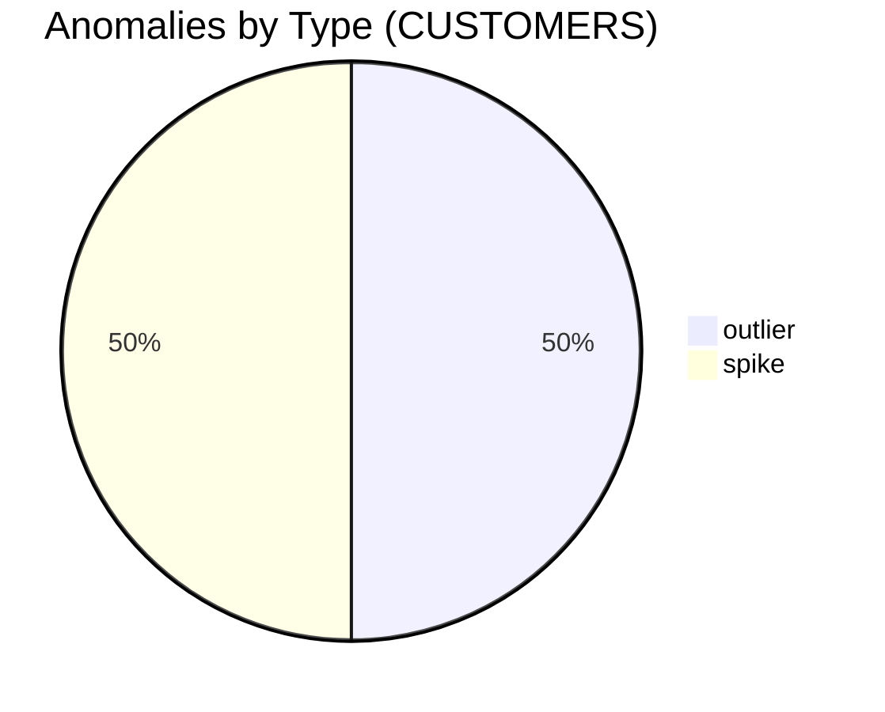

# Anomalies — PUBLIC.CUSTOMERS

## Anomaly Detection

| Type | Column | Observed at | Details |
|---|---|---|---|
| outlier | PHONE | 2026-07-06T17:42:51Z | null_rate=0.0713; expected_max=0.05 |
| spike | EMAIL | 2026-07-06T17:42:51Z | null_rate_increase=3.2% |

## Quality Flags

| Severity | Category | Column | Message |
|---|---|---|---|
| medium | nulls | PHONE | PHONE contains more than 5% NULL values. |
| low | duplicates | CUSTOMER_ID | 12 duplicate CUSTOMER_ID values detected. |
| high | pii | EMAIL | Sensitive PII columns detected. |
| low | freshness | LAST_UPDATED | Table refreshed within SLA. |

## Outlier Findings

## Distribution Summaries

No data available (no numeric distributions/histograms provided beyond anomaly details and sample values).
