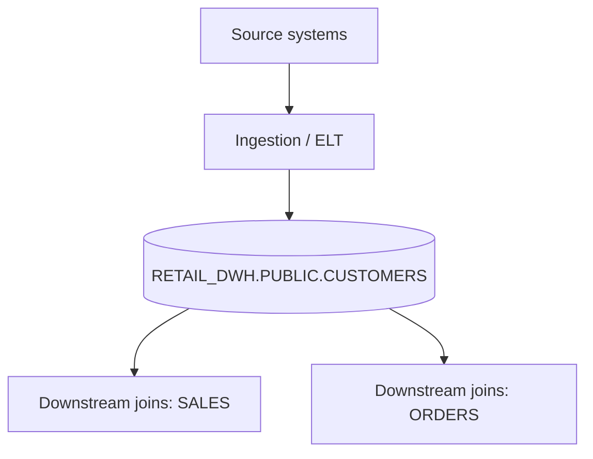

# Dashboard — RETAIL_DWH.PUBLIC.CUSTOMERS

## At-a-glance

- **Rows:** 12,543
- **Freshness:** Healthy (`2026-07-01 08:15:00`)
- **Key:** CUSTOMER_ID (duplicates: 0)
- **PII:** EMAIL, PHONE
- **Open rule violations:** 1
- **Active anomalies:** 1

