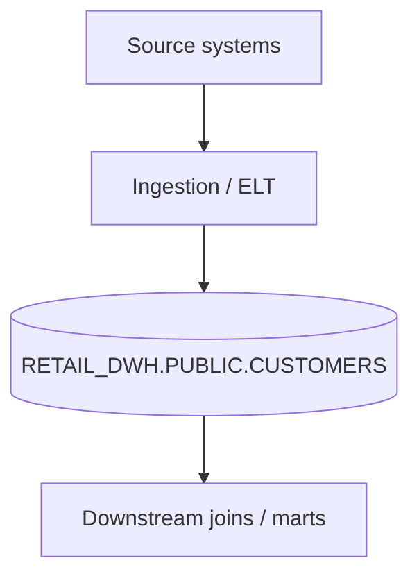

# Dashboard — RETAIL_DWH.PUBLIC.CUSTOMERS

## At-a-glance
- **Rows:** 12,543
- **Overall quality score:** 93 / 100
- **Freshness:** last updated `2026-07-06T17:42:51Z` (SLA max lag: 4h)
- **Duplicates:** 12 duplicate rows on key `CUSTOMER_ID`
- **PII:** EMAIL, PHONE
- **Open quality flags:** 4 (high: 1, medium: 1, low: 2)
- **Anomalies:** 2

