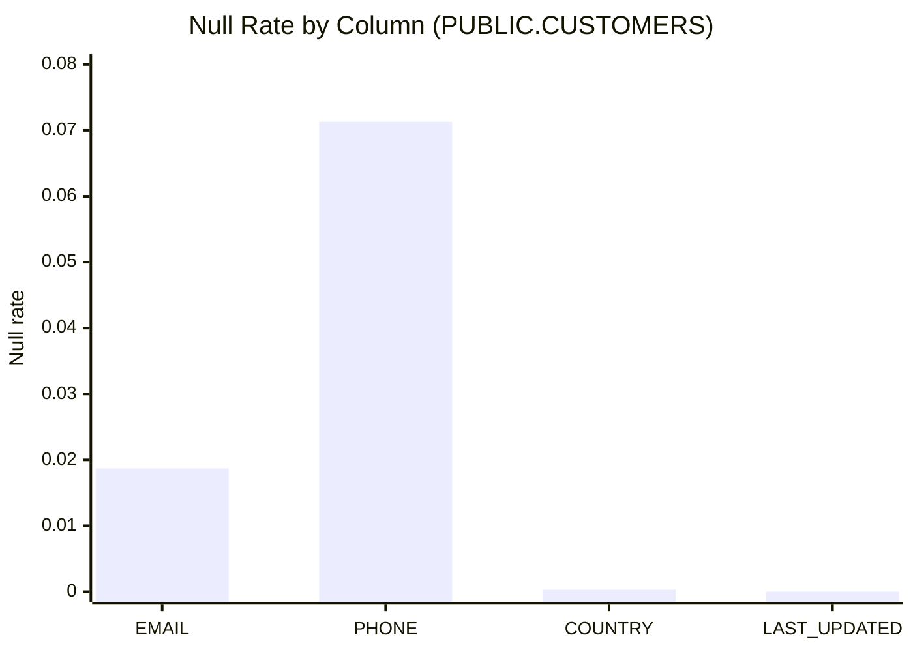

# Null Analysis — PUBLIC.CUSTOMERS

## Null Percentage Charts



(ASCII fallback)

```
EMAIL        | ██░░░░░░░░ 1.87%
PHONE        | ███████░░░ 7.13%
COUNTRY      | ░░░░░░░░░░ 0.03%
LAST_UPDATED | ░░░░░░░░░░ 0.00%
```

## Null Severity Rankings

Severity rules (deterministic):
- High: >= 10%
- Medium: >= 5% and < 10%
- Low: > 0% and < 5%
- None: 0%

| Rank | Column | Null rate | Severity |
|---:|---|---:|---|
| 1 | PHONE | 0.0713 | Medium |
| 2 | EMAIL | 0.0187 | Low |
| 3 | COUNTRY | 0.0003 | Low |
| 4 | LAST_UPDATED | 0.0 | None |

## Column Completeness Analysis

| Column | Completeness (1 - null_rate) |
|---|---:|
| EMAIL | 0.9813 |
| PHONE | 0.9287 |
| COUNTRY | 0.9997 |
| LAST_UPDATED | 1.0 |
