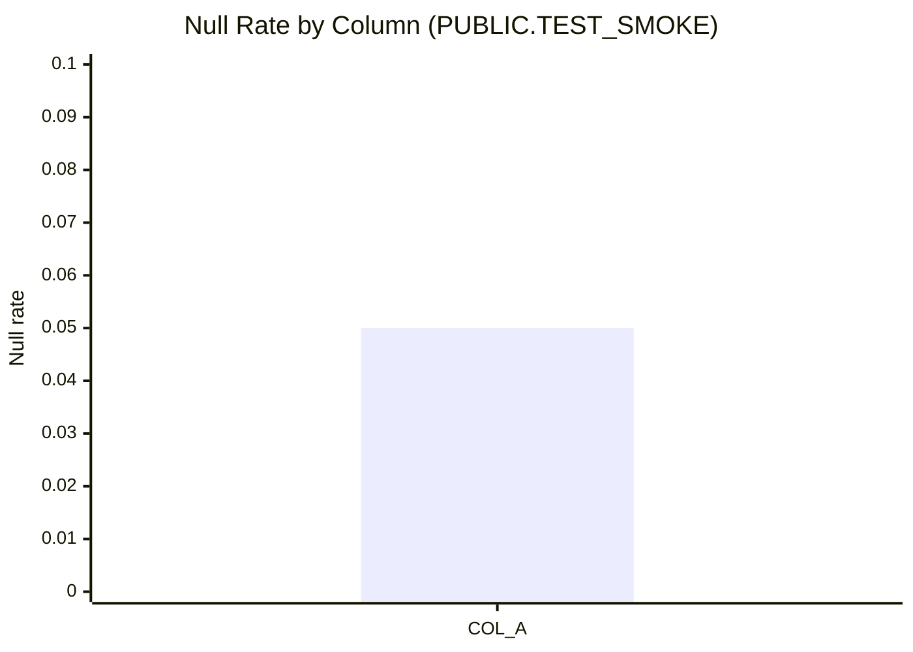

# Null Analysis — PUBLIC.TEST_SMOKE

## Null Percentage Charts



(ASCII fallback)

```
COL_A | █████░░░░░ 5.00%
```

## Null Severity Rankings

Severity rules (deterministic):
- High: >= 10%
- Medium: >= 5% and < 10%
- Low: > 0% and < 5%
- None: 0%

| Rank | Column | Null rate | Severity |
|---:|---|---:|---|
| 1 | COL_A | 0.05 | Medium |

## Column Completeness Analysis

| Column | Completeness (1 - null_rate) |
|---|---:|
| COL_A | 0.95 |
